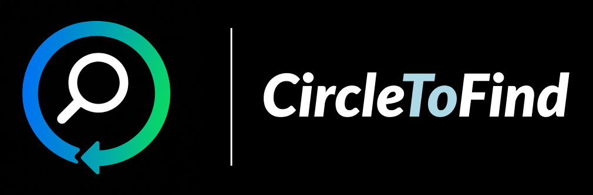
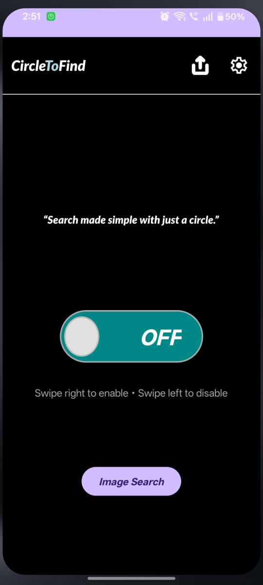
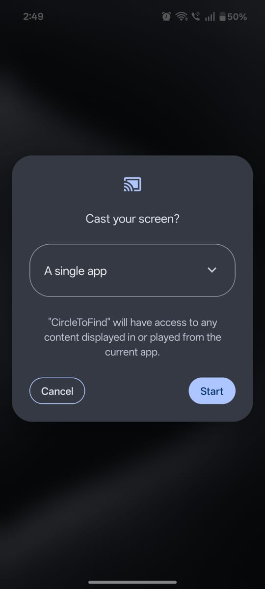
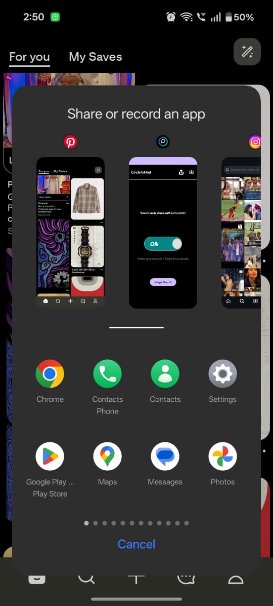
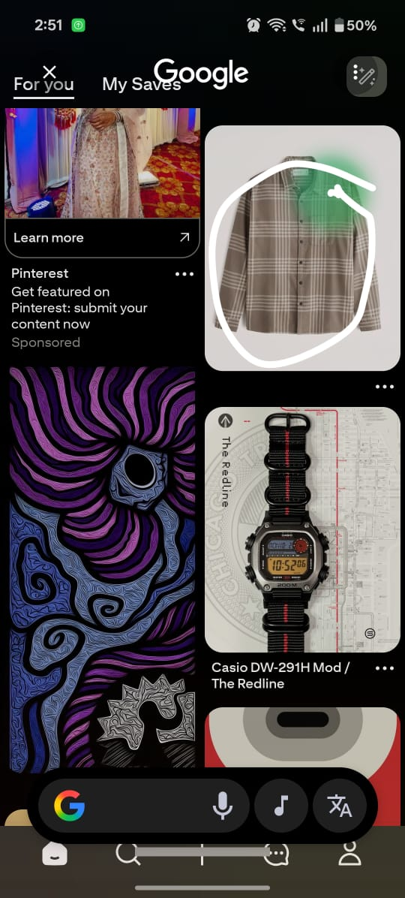
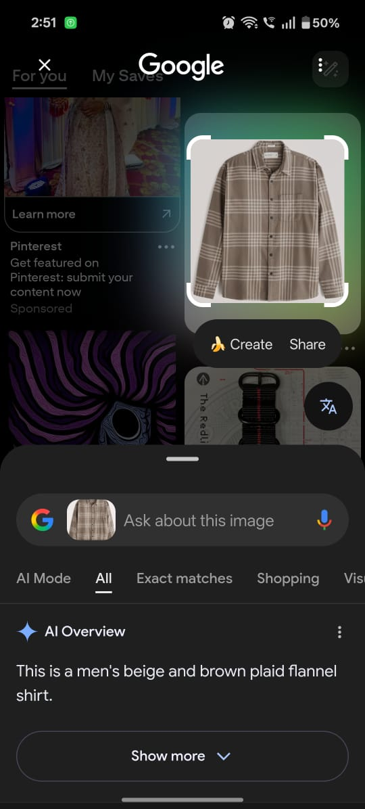

### *Search made simple — with just a circle.*

---

## 📌 Overview

**CircleToFind** is a smart visual search assistant that lets you **draw a circle around anything on your screen** to search it instantly.  
Whether it’s a shirt, watch, product, or face — just **circle and find**.  

> ⚠️ *Note: Work is still in progress. Some features are under development.*

---

## 🎯 Features

| Feature | Description |
|--------|-------------|
| 🔍 Circle to Search | Draw a circle to trigger instant on-screen object recognition |
| 🤖 Google Lens Integration | Uses visual AI for search and context |
| 🖼 Image Selection Mode | Users can search using saved images |
| 🌙 Clean & Modern UI | Soft color theme with smooth toggle interaction |
| 🎚 Swipe Toggle | Swipe right to enable / left to disable service |

---

## 📸📂 Project Structure

| Home Screen | Cast Permission | Share Screen UI |
|------------|----------------|----------------|
|  |  |  |

| Circle Demonstration | Search Result |
|---------------------|--------------|
|  |  |

---

## 🛠 Tech Stack

| Tool / Language | Purpose |
|----------------|---------|
| **Kotlin** | Main application logic |
| **Android SDK** | UI & system integration |
| **Media Projection API** | Screen capture / overlay |
| **Google Lens / Intent-Based Search** | Visual content recognition |

---

## 🚧 Work in Progress

### Coming Next:
- Floating overlay bubble
- Gesture circle recognition accuracy improvements
- Optional custom AI model support

---

## 💡 Idea Behind This App

Scrolling Pinterest or Instagram and saw something interesting?  
Instead of *thinking what keyword to search*,  
just **draw a circle → search → done ✅**

---

## 🤝 Contribute

Pull requests are welcome.  
If you’d like to suggest features, open an issue!

---

**Made with ❤️ by Mohammad Raahim Khan**

